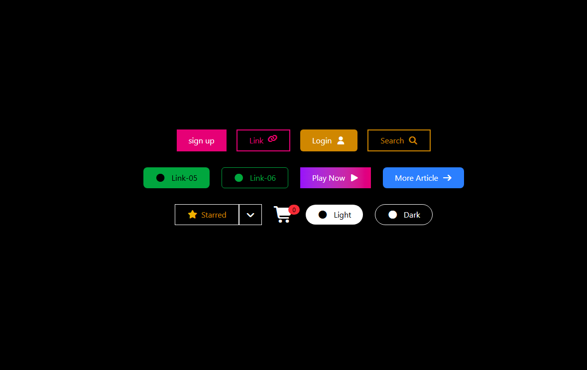

# 🎨 Apps Icons UI – Tailwind CSS Buttons Collection

A modern button and icon UI collection built using **Tailwind CSS** and **Font Awesome**.
This project demonstrates different button styles including solid, outline, gradient, icon buttons, grouped buttons, and badge indicators.

---

## 🚀 Features

* ✅ Solid Buttons
* ✅ Outline Buttons
* ✅ Gradient Buttons
* ✅ Icon Buttons
* ✅ Button Groups
* ✅ Notification Badge (Cart Counter)
* ✅ Rounded & Pill Buttons
* ✅ Hover Effects
* ✅ Responsive Flex Layout

---

## 🛠️ Technologies Used

* [Tailwind CSS (v4 CDN)](https://tailwindcss.com/)
* [Font Awesome Icons](https://fontawesome.com/)
* HTML5

---




## 📂 Project Structure

```
index.html
README.md
```

---

## 💡 Button Categories

### 🔹 Top Section

* Sign Up Button (Solid Pink)
* Link Button (Outline + Icon)
* Login Button (Solid Yellow + User Icon)
* Search Button (Outline Yellow + Search Icon)

### 🔹 Middle Section

* Green Solid & Outline Buttons
* Gradient Play Button
* More Article Button with Arrow Icon

### 🔹 Bottom Section

* Star Button Group with Dropdown
* Shopping Cart Icon with Notification Badge
* Light & Dark Rounded Buttons

---

## 📸 Preview

The UI contains:

* Dark background layout
* Centered flexbox structure
* Interactive hover states
* Icon-enhanced buttons
* Clean and modern spacing

---

## ▶️ How to Run

1. Download or clone the repository.
2. Open `index.html` in your browser.
3. No installation required (uses CDN links).

---

## 🎯 Purpose

This project is ideal for:

* Practicing Tailwind CSS
* Learning button styling variations
* Creating reusable UI components
* Beginner frontend development projects

---

## 📌 Future Improvements

* Add JavaScript interactions
* Add responsive navbar
* Add dark/light toggle functionality
* Convert into reusable components
* Improve accessibility (ARIA labels)

---

## 📄 License

This project is open-source and free to use for learning purposes.

## Author

**Amritha Mohanan**
Aspiring web Developer
Kochi, Kerala


